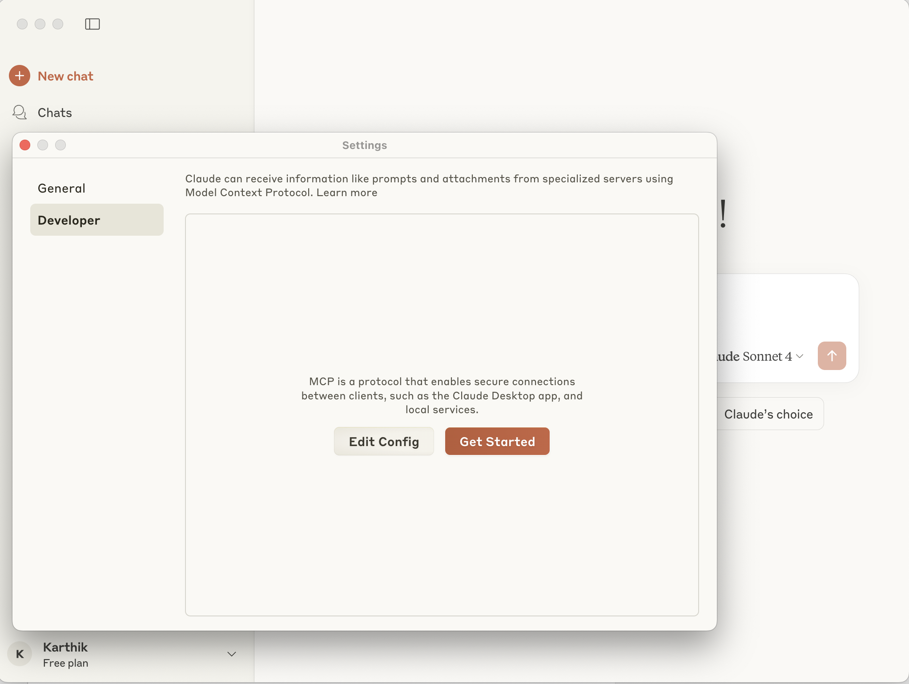
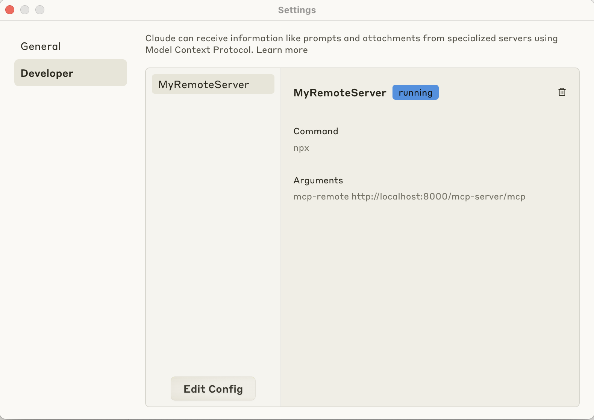
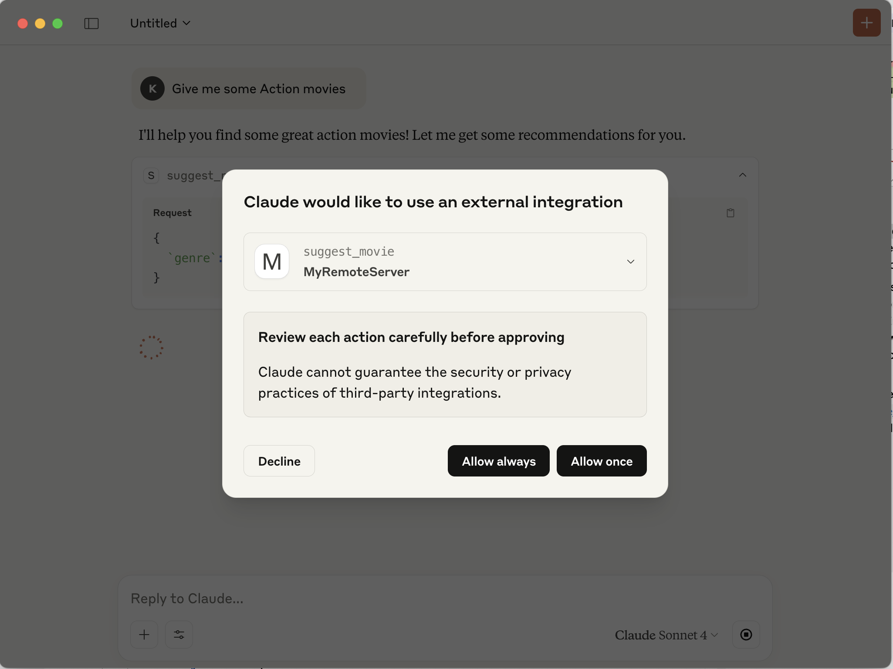
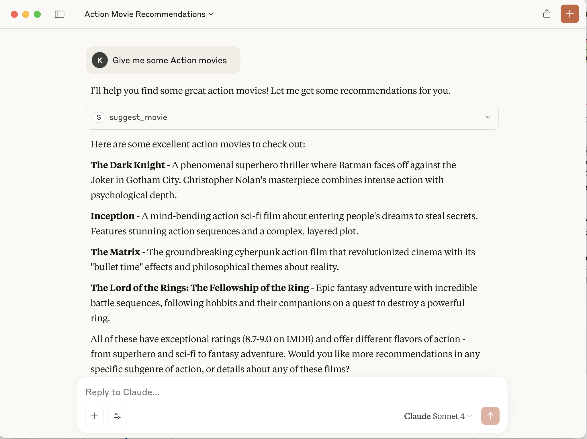

# 🚀 Integrating MCP into existing FastAPI Application

A FastAPI application with Model Context Protocol (MCP) integration for AI tools such as movie recommendation and search.

THis repo is to demonstrate integrating MCP tools into exisitng FastAPI App.

## 📚 Resources
- [Medium article on Integrating MCP into exisitng FastAPI application ](https://medium.com/@droidnext/model-context-protocol-mcp-sampling-e966524db565)
  - Full URL: https://medium.com/@droidnext/model-context-protocol-mcp-sampling-e966524db565

---

## 🧰 Features

- ⚡ FastAPI backend with MCP integration
- 🎬 Movie recommendation and search tools
- 🔐 Configurable JWT authentication
- 🛠️ Environment-specific YAML configurations

---

## 📦 Prerequisites

- Python 3.8+
- Node.js 14+ (for MCP inspector)
- [`uv`](https://github.com/astral-sh/uv) (Python dependency management)

---

## 🧑‍💻 Installation

### Clone the repository

```bash
git clone <repository-url>
cd <repository-name>

## 🛠️ Setup Instructions

Set up the development environment using `uv`:

```bash
uv init
uv venv
source .venv/bin/activate
uv pip install -r requirements.txt


Install MCP inspector:
```bash
npm install @modelcontextprotocol/inspector
```

## Configuration

The application uses environment-specific YAML configuration files in the `config` directory:

- `app_config.dev.yaml`: Development settings
- `app_config.prod.yaml`: Production settings

You can override settings using environment variables or a `.env` file.

### Key Configuration Options

- `APP_ENV`: Set to 'dev' or 'prod' to use different configurations
- `ENABLE_JWT`: Toggle JWT authentication
- `MCP_TOOL_TIMEOUT`: Set timeout for MCP tools

## 🚀 Running the Application

1. Start the FastAPI server:
```bash
# Development
APP_ENV=dev python -m uvicorn app.main:app --reload

# Production
APP_ENV=prod python -m uvicorn app.main:app
```

2. Start the MCP inspector:
```bash
npx @modelcontextprotocol/inspector node build/index.js
```

## 📡 API Endpoints
- `/routes`: List all available routes
- `/api/v1/movies`: Movie-related endpoints
- `/mcp-server/mcp`: MCP tools and endpoints

## 🛠️ MCP Tools

The application provides the following MCP tools:

- `suggest_movie`: Get movie recommendations by genre
- `get_top_movies`: Get top-rated movies
- `search_movies`: Search movies by title, description, or cast

## Development

### Environment Setup

1. Create a `.env` file:
```bash
APP_ENV=dev
# Add other environment variables as needed
```

2. Configure JWT (if enabled):
```bash
JWT_SECRET_KEY=your-secret-key
```

### 🧪 Testing

```bash
pytest
```

## 🖥️ Connecting Claude Desktop

To connect Claude Desktop to your local FastAPI MCP server, follow these steps:

1. Open Claude Desktop and navigate to **Settings > Developer**.
2. Click on **Edit Config**. This will open the `claude_desktop_config.json` file.

3. Add your server configuration to the `mcpServers` object. Here's an example:

```json
{
  "mcpServers": {
    "MyRemoteServer": {
      "command": "npx",
      "args": [
        "mcp-remote",
        "http://localhost:8000/mcp-server/mcp"
      ]
    }
  }
}
```

4. Replace `"MyRemoteServer"` with a name of your choice.
5. Save the `claude_desktop_config.json` file.
6. Restart Claude Desktop for the changes to take effect.

Once connected, your server should appear as running in the settings:




Enter your prompt in to chat field:
"Give me some Action movies"
This shoule pop up window asking permission to talk to your Movies MCP server




Claude Desktop will connect to MCP server and invoke suggsted_movies tool to fetch movies and pass to the LLM




## License

MIT


